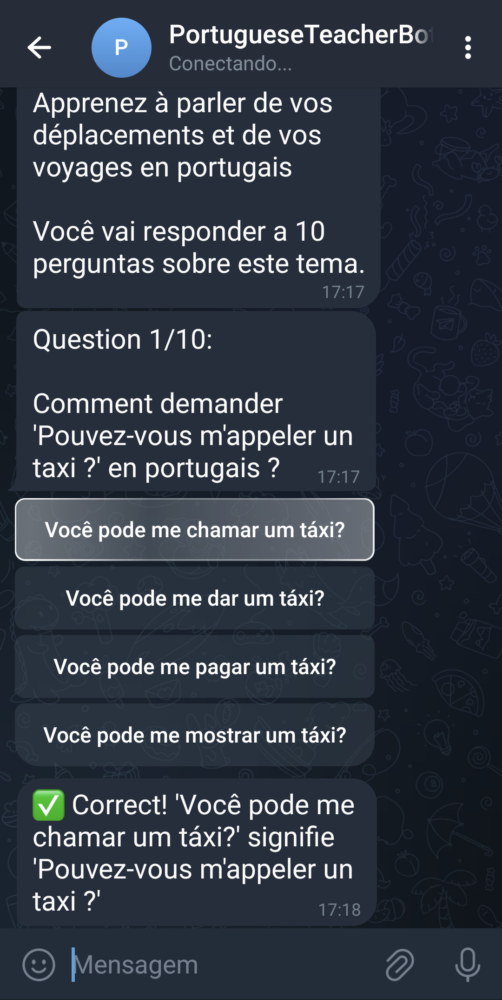
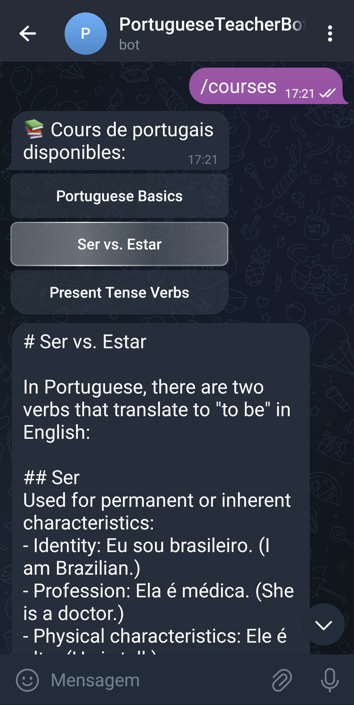
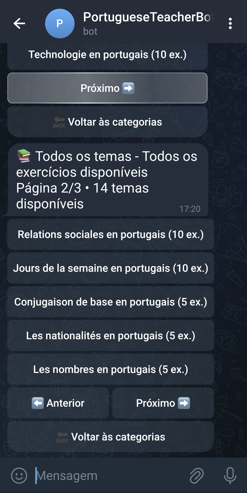

# 🇵🇹 Portuguese Learning Bot

A **Telegram bot** that helps users practice Portuguese with interactive exercises, quizzes, and sentence completion challenges.

<p align="center">
  
  
  
</p>

## 🚀 Features

- 📚 **Vocabulary quizzes** – Test your Portuguese word knowledge.
- ✍️ **Fill-in-the-blank sentences** – Improve grammar and sentence structure.
- 🎯 **Instant exercises** – Get a random exercise at any time.
- 📊 **Statistics tracking** – See your progress over time.
- 📖 **Course browsing** – Find structured Portuguese courses.

## 🔧 Installation & Setup

### 1️⃣ Clone the repository

```bash
git clone https://github.com/ayadgu/portuguese-learning-bot.git
cd portuguese-learning-bot
```

2️⃣ Install dependencies and set up the environment

```python
pip install -r requirements.txt
```

Create a .env file and add your Telegram Bot API key:
TELEGRAM_BOT_TOKEN=your_bot_token_here

3️⃣ Run the bot
python bot.py

📌 Commands

| Command         | Description                         |
| --------------- | ----------------------------------- |
| `/start`        | Start receiving exercises           |
| `/now`          | Get a random exercise immediately   |
| `/courses`      | Browse available Portuguese courses |
| `/stats`        | View your exercise statistics       |
| `/generate [n]` | Generate new exercises (default: 5) |
| `/help`         | Show help message                   |

🛠 Tech Stack

- Python 🐍
- Telebot (pyTelegramBotAPI) 🤖
- JSON for storing exercises 📂

📬 Contact
Feel free to contribute or suggest improvements!

🌟 If you find this bot useful, consider giving it a ⭐ on GitHub!
